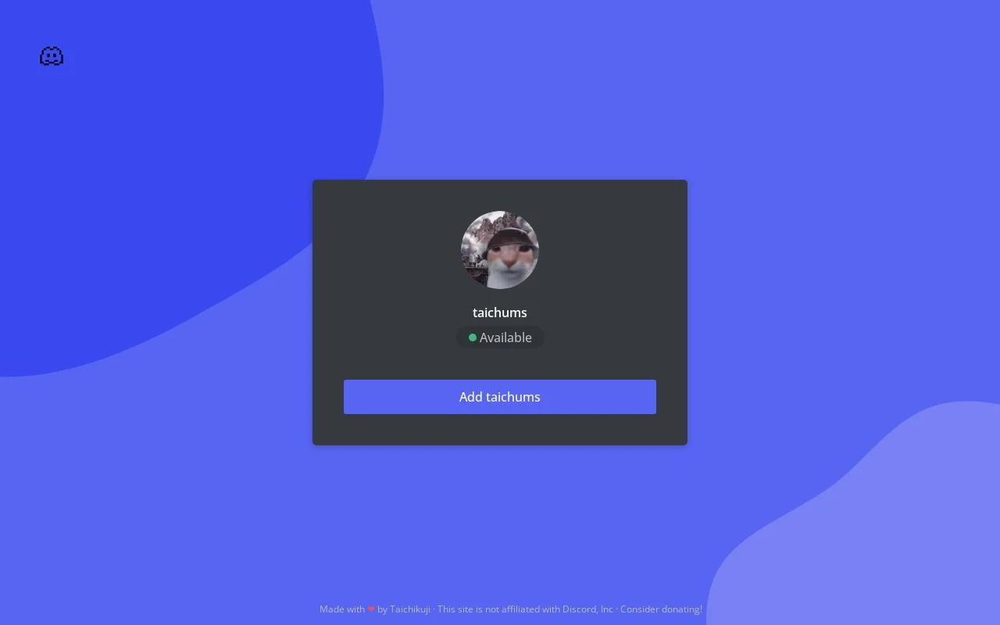

# Discordid: Show off your Discord profile!

   
  
  
  

## Why Netlify?

Mainly to learn how Netlify functions work. I wanted to make a website that was dynamic enough while being serverless.

After completing this project, I felt like I understood the pros and cons of using this kind of setup, and I'm glad I ended up doing it this way!

## How do I make it work?

There's a quick introduction on how to work with **Discordid** on the **[wiki!](https://github.com/taichikuji/discordid/wiki)**

## What is this project exactly?

This project is a website hosted on Netlify to show off your Discord profile anywhere you want! It'll show your profile picture and your user in a simple but neat way!

This was initially a template of an Introduction site I made myself with Discord in mind.

It uses similar css assets from the site!

### If you want to learn more, you can go to the [Wiki!](https://github.com/taichikuji/discordid/wiki)